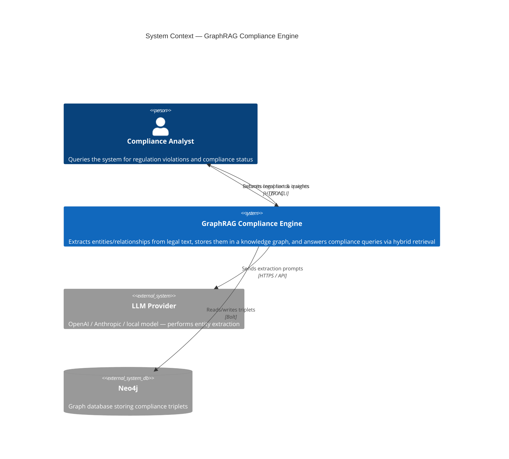

# C4 Level 1 — System Context Diagram

Shows the GraphRAG Compliance Engine and its external actors.

## Data Flow Summary

| Flow | Latency Target | Notes |
|------|---------------|-------|
| Analyst → Engine (query) | < 200ms | Local parsing + parallel retrieval |
| Engine → LLM (extraction) | 1–5s | Depends on provider; batched where possible |
| Engine → Neo4j (read/write) | < 50ms | Local instance on Bolt protocol |
| Engine → Analyst (response) | < 2s total | Dominated by LLM call during ingestion; retrieval is fast |
