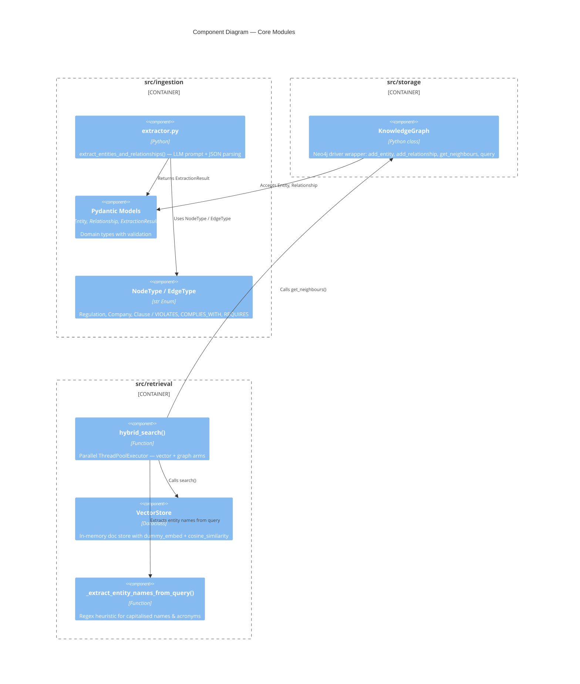

# C4 Level 3 — Component Diagram

Zooms into the three main modules and their internal components.

```mermaid
C4Component
    title Component Diagram — Core Modules

    Container_Boundary(ingestion, "src/ingestion") {
        Component(extractor, "extractor.py", "Python", "extract_entities_and_relationships() — LLM prompt + JSON parsing")
        Component(models_ing, "Pydantic Models", "Entity, Relationship, ExtractionResult", "Domain types with validation")
        Component(enums, "NodeType / EdgeType", "str Enum", "Regulation, Company, Clause / VIOLATES, COMPLIES_WITH, REQUIRES")
    }

    Container_Boundary(storage, "src/storage") {
        Component(kg, "KnowledgeGraph", "Python class", "Neo4j driver wrapper: add_entity, add_relationship, get_neighbours, query")
    }

    Container_Boundary(retrieval, "src/retrieval") {
        Component(hybrid, "hybrid_search()", "Function", "Parallel ThreadPoolExecutor — vector + graph arms")
        Component(vs, "VectorStore", "Dataclass", "In-memory doc store with dummy_embed + cosine_similarity")
        Component(mention, "_extract_entity_names_from_query()", "Function", "Regex heuristic for capitalised names & acronyms")
    }

    Rel(extractor, models_ing, "Returns ExtractionResult")
    Rel(extractor, enums, "Uses NodeType / EdgeType")
    Rel(kg, models_ing, "Accepts Entity, Relationship")
    Rel(hybrid, vs, "Calls search()")
    Rel(hybrid, kg, "Calls get_neighbours()")
    Rel(hybrid, mention, "Extracts entity names from query")
```
