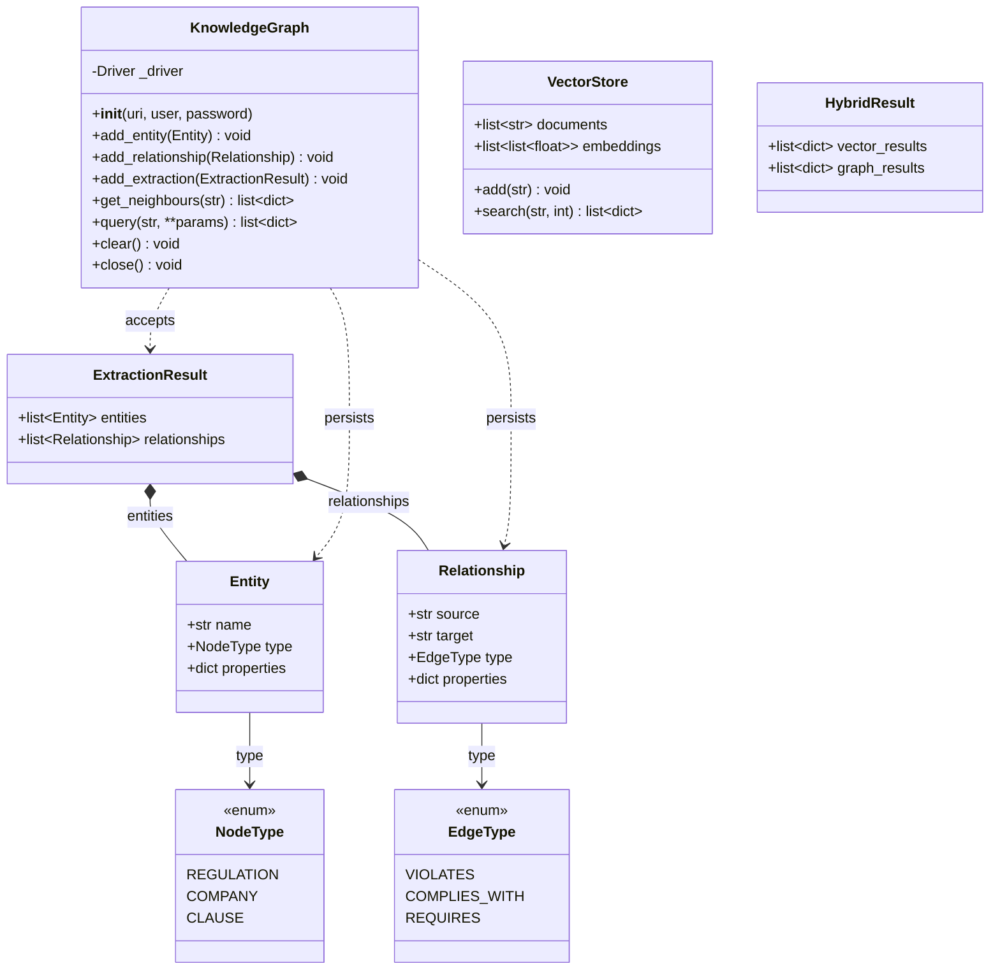
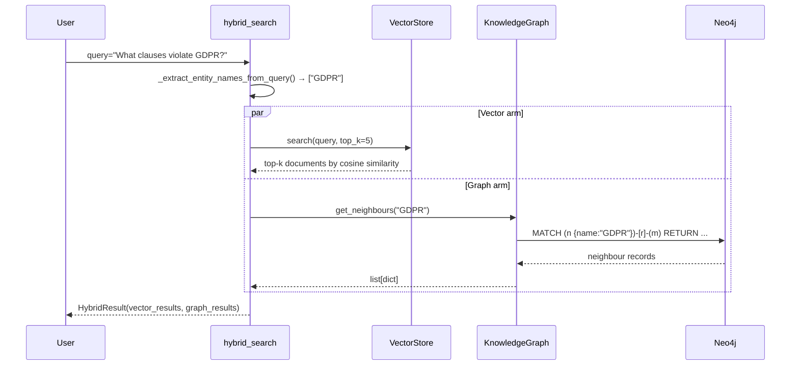

# C4 Level 4 — Code Diagram

Class-level detail for the core domain types and their interactions.

```mermaid
classDiagram
    class NodeType {
        <<enum>>
        REGULATION
        COMPANY
        CLAUSE
    }

    class EdgeType {
        <<enum>>
        VIOLATES
        COMPLIES_WITH
        REQUIRES
    }

    class Entity {
        +str name
        +NodeType type
        +dict properties
    }

    class Relationship {
        +str source
        +str target
        +EdgeType type
        +dict properties
    }

    class ExtractionResult {
        +list~Entity~ entities
        +list~Relationship~ relationships
    }

    class KnowledgeGraph {
        -Driver _driver
        +__init__(uri, user, password)
        +add_entity(Entity) void
        +add_relationship(Relationship) void
        +add_extraction(ExtractionResult) void
        +get_neighbours(str) list~dict~
        +query(str, **params) list~dict~
        +clear() void
        +close() void
    }

    class VectorStore {
        +list~str~ documents
        +list~list~float~~ embeddings
        +add(str) void
        +search(str, int) list~dict~
    }

    class HybridResult {
        +list~dict~ vector_results
        +list~dict~ graph_results
    }

    Entity --> NodeType : type
    Relationship --> EdgeType : type
    ExtractionResult *-- Entity : entities
    ExtractionResult *-- Relationship : relationships
    KnowledgeGraph ..> Entity : persists
    KnowledgeGraph ..> Relationship : persists
    KnowledgeGraph ..> ExtractionResult : accepts
```

## Sequence — Hybrid Search

```mermaid
sequenceDiagram
    participant User
    participant hybrid_search
    participant VectorStore
    participant KnowledgeGraph
    participant Neo4j

    User->>hybrid_search: query="What clauses violate GDPR?"
    hybrid_search->>hybrid_search: _extract_entity_names_from_query() → ["GDPR"]

    par Vector arm
        hybrid_search->>VectorStore: search(query, top_k=5)
        VectorStore-->>hybrid_search: top-k documents by cosine similarity
    and Graph arm
        hybrid_search->>KnowledgeGraph: get_neighbours("GDPR")
        KnowledgeGraph->>Neo4j: MATCH (n {name:"GDPR"})-[r]-(m) RETURN ...
        Neo4j-->>KnowledgeGraph: neighbour records
        KnowledgeGraph-->>hybrid_search: list[dict]
    end

    hybrid_search-->>User: HybridResult(vector_results, graph_results)
```
